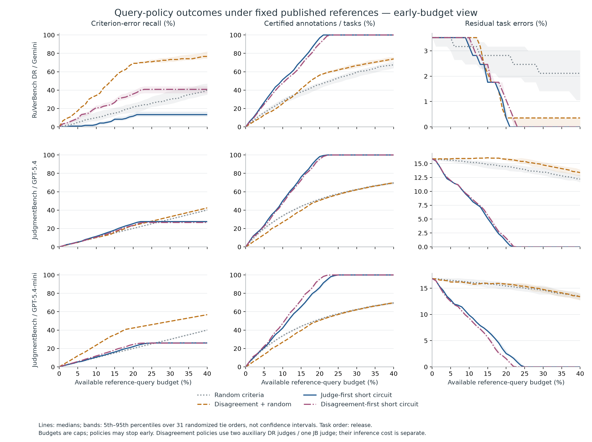

# What Should Reference Labels Buy?

### Estimation and Certification in Conjunctive Evaluations

[](https://github.com/Itsxuchen/reference-label-value/actions/workflows/reproduce.yml)

Research code, compact analysis data, and saved results for a retrospective study of reference checking in rubric-based evaluation. A reference check can help estimate judge accuracy, certify an individual outcome, or repair an existing verdict. When every retained criterion must pass, these goals can favor different checking and updating protocols.

**Manuscript in preparation; no arXiv identifier has been assigned.**

The study uses fixed released references and saved predictions from **RuVerBench** and **JudgmentBench**. JudgmentBench's strict all-pass outcome is a researcher-defined stress test. The nine analysis cells come from two data families; they are not nine independent replications. One query reveals one existing reference bit. Query counts do not measure human time.

## Research questions

1. **Error propagation and updating:** When do criterion-level errors and partial corrections change conjunctive task verdicts, and how does the verdict-update rule affect these changes?
2. **Allocation of limited references:** How do sampling units and query allocations trade off estimation precision, certification coverage, and residual verdict error under stated reference-query resources?
3. **Evidence sufficiency:** Which reference information suffices to certify individual verdicts or identify aggregate success, and how does identification differ from statistical estimation?

RQ2 is the main empirical analysis. RQ1 examines the consequences of partial replacement and delayed updates; RQ3 supplies the information conditions needed to interpret the other results. Short-circuit evaluation, Boolean certificates, and probability sampling are established tools. The contribution is their controlled empirical comparison and its conditional findings.

## Main results

At a **20% criterion-query cap**, the table compares random criterion sampling with a fixed allocation that spends up to half the cap on judge-first short circuit, then samples independently from the remaining criteria. All shown policies use the same actual number of queries within each cell.

| Reference frame / allocation | Actual queries | Certified units | Residual verdict errors | Accuracy interval width (pp) |
|---|---:|---:|---:|---:|
| RuVerBench DR Gemini / random criterion SRS | 323 | 131 | 8 | 5.51 |
| RuVerBench DR Gemini / fixed 50/50 allocation | 323 | 169 | 9 | 7.62 |
| JudgmentBench GPT-5.4 / random criterion SRS | 4,697 | 798 | 223 | 2.21 |
| JudgmentBench GPT-5.4 / fixed 50/50 allocation | 4,697 | 1,035 | 133 | 2.95 |

Entries after query count are **marginal medians over seeds 1–31**, with release task order; they need not describe a single realized run. Accuracy is criterion-level microagreement with the fixed reference. Its intervals invert exact hypergeometric tails under the stated sampling design; they are conditional, pointwise 95% intervals. [Exact result keys and additional comparisons](docs/RESULTS.md)

- **Allocation can improve task outcomes while reducing estimation precision.** In the JudgmentBench comparison above, the mixed allocation improves certification and residual errors in all 31 paired orders, but produces wider accuracy intervals. In DR it increases certification while leaving more residual errors in 18 of 31 orders. The fixed split is a comparison condition, not an optimal policy.
- **More criterion repairs need not produce fewer task errors.** In one JudgmentBench disagreement-only endpoint, 4,316 queries repair 1,217 criterion errors, but task errors change from 244 to 245: two false passes and two false fails are repaired, while five false passes are introduced. On a separate matched set of 4,697 queries, certificate-gated updating prevents six new false passes but delays nine repairs, changing residual errors from 239 to 242.
- **The contrary cases matter.** The criterion-error-discovery versus certification reversal survives all 31 randomized tie orders for DR Gemini and JudgmentBench mini, but none for the stronger JudgmentBench judge. Directly using the stronger primary also outperforms the weak-primary-plus-strong-auxiliary short-circuit policy on both task metrics in the tested release-order comparison. These results do not establish universal superiority of either a hybrid or a single judge.



The figure shows four selected policies from the seven-policy study. Lines are medians and bands are 5–95% ranges across randomized orders, **not confidence intervals**. The horizontal axis is available budget; actual queries stop when a policy exhausts its candidates or finishes certification. The fixed 50/50 allocation is a separate extension summarized in the table above.

## Get started

From the repository root, inside a Python environment:

```bash
python -m pip install -r requirements.lock.txt
python -m src.check_package
python -m pytest
python -m src.reproduce --mode smoke --output artifacts/smoke
```

For the complete reproduction and comparison against the included results:

```bash
python -m src.reproduce --mode full --output artifacts/reproduced
python -m src.verify_release --results artifacts/reproduced
```

Release validation: **130 tests passed; complete offline replay in 169 seconds** in the recorded environment. [Execution receipts](docs/REPRODUCIBILITY.md#release-010-verification)

The scientific replay uses local inputs and requires no model API key. Smoke mode is a bounded execution check; use full mode for the complete declared analysis. Commands write to the supplied output directory, while archived numerical targets remain under `artifacts/expected/`. See [reproduction scope, output files, and validation](docs/REPRODUCIBILITY.md).

## Read the study

| Document | Contents |
|---|---|
| [Methods](docs/METHODS.md) | Targets, query policies, update rules, sampling estimators, and information conditions |
| [Results](docs/RESULTS.md) | Numerical anchors, full-grid coverage, counterexamples, and source keys |
| [Reproducibility](docs/REPRODUCIBILITY.md) | Execution modes, expected results, and the limits of each check |
| [Data sources](docs/DATA_SOURCES.md) | Upstream provenance, included fields, transformations, and source terms |
| [Policy protocol](context/conjunction_policy_protocol.md) | Policy, budget, ordering, and sensitivity contract |
| [Label-value protocol](context/conjunction_label_value_protocol.md) | Fixed allocation, exact inference, and whole-unit sampling contract |

The information-disclosure analysis retains complete references while hiding and restoring their task links. It adds no labels. Its finite feasible ranges are distinct from sampling confidence intervals. An optional JudgmentBench pairing diagnostic holds both arm means fixed and studies covariance and standard-error uncertainty; it is not evidence of a new system ranking. [Details](docs/METHODS.md#information-sufficiency-and-pairing)

## Data, software, and citation

The included analysis inputs contain labels, scores, scoring metadata, and identifiers needed for replay. Source task texts, full generated responses, free-text comments, and recorded human-time fields are excluded. The package reproduces analysis conditional on the released references; it does not independently validate their semantic correctness.

Code licensing is specified in [LICENSE](LICENSE). Dataset-derived files retain the terms identified in [DATA_SOURCES](docs/DATA_SOURCES.md) and [THIRD_PARTY_NOTICES](THIRD_PARTY_NOTICES.md); the software license does not relicense upstream material.

Use [CITATION.cff](CITATION.cff) to cite this software and results package, and cite the upstream datasets when using their derived records. Until a manuscript identifier is assigned, describe the package as research software rather than citing a nonexistent preprint or publication.
