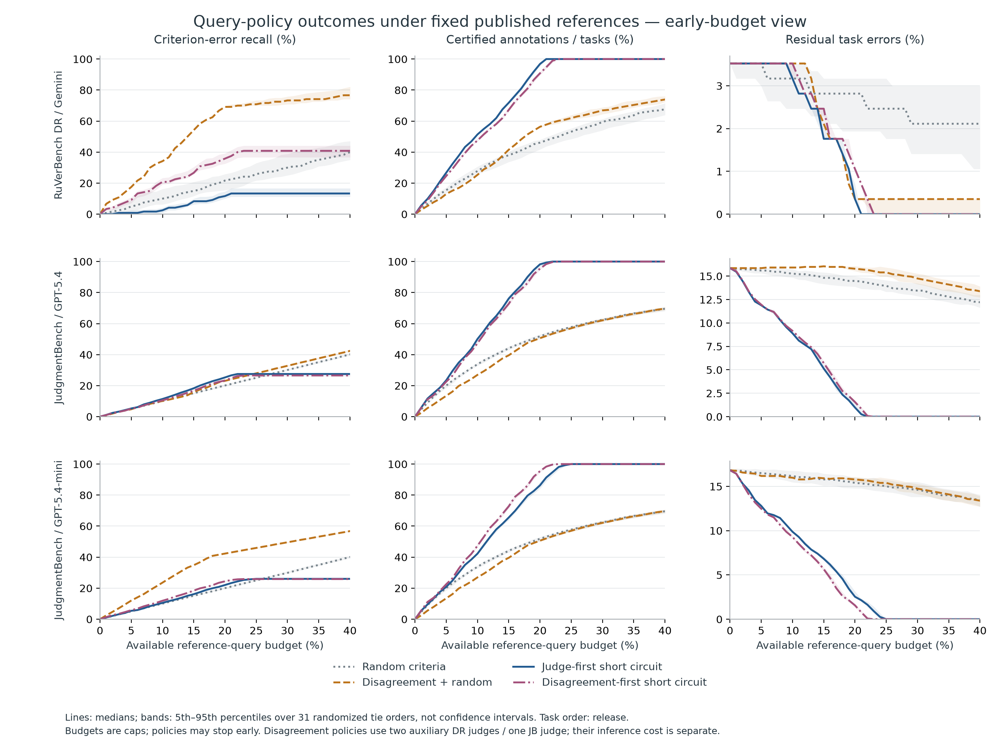
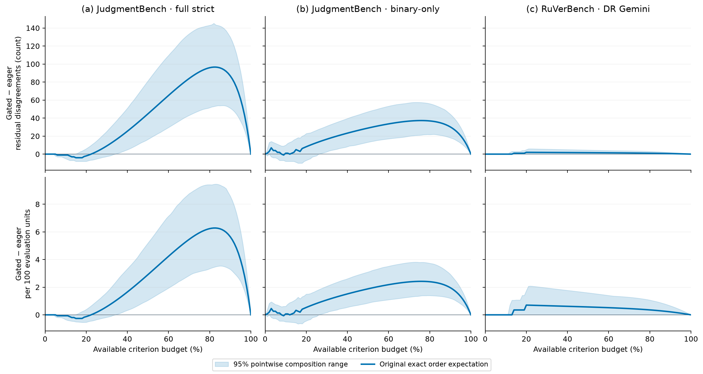

# What Should Reference Labels Buy?

### Estimation, Certification, and Repair in Conjunctive Evaluations

[](https://github.com/Itsxuchen/RefEval/actions/workflows/reproduce.yml)

Research code, compact analysis data, and saved results for a retrospective study of reference checking in rubric-based evaluation. A reference check can help estimate judge accuracy, certify an individual outcome, or repair an existing verdict. When every retained criterion must pass, these goals can favor different checking and updating protocols.

**Complete manuscript draft:** [PDF](artifacts/manuscript/paper.pdf) · [LaTeX source](artifacts/manuscript/paper.tex) · [methods and proofs](artifacts/manuscript/methods_appendix.tex) · [build and verification instructions](docs/REPRODUCIBILITY.md#manuscript-build-and-claim-checks). No arXiv identifier has been assigned.

The study uses fixed released references and saved predictions from **RuVerBench** and **JudgmentBench**. JudgmentBench's strict all-pass outcome is a researcher-defined stress test. The nine analysis cells come from two data families; they are not nine independent replications. One query reveals one existing reference bit. Query counts do not measure human time.

## Research questions

Under explicit evaluation targets and information conditions, how do reference-query allocation and verdict updating affect estimation precision, certification coverage, and residual error in conjunctive evaluations?

1. **Error propagation and updating:** For the same queried reference labels, how do immediate and certificate-gated updates change task verdicts, and which error structures and query orders determine their budget-dependent effects?
2. **Allocation of limited references:** How do sampling units and query allocations trade estimation precision against certification coverage and verdict repair, and when do certification gains translate into fewer residual disagreements?
3. **Evidence sufficiency:** Which task-level conclusions are determined by criterion summaries and queried reference labels, what additional task associations are needed, and how does identification differ from statistical estimation?

RQ2 is the main empirical analysis. RQ1 separates prevented false passes from delayed repairs and quantifies their budget-dependent balance on matched queried sets. RQ2 follows how additional certificates translate into repaired verdicts while measuring estimation precision. RQ3 identifies which task associations are needed to support the reported conclusions. Reference replacement and task-composition resampling separately test the stability of these effects.

Prior work already studies component-level screening, sampling tradeoffs, Boolean certification, error unmasking and selective updating. This study focuses on their measured consequences when reference queries resolve components of conjunctive outcomes and verdict updating is specified separately. See the [comparison of targets, observations, updates and guarantees](docs/METHODS.md#closest-comparisons-target-observation-update-and-guarantee) for the scope of the empirical contribution.

## Main results

At a **20% criterion-query cap**, the table compares random criterion sampling with a fixed allocation that spends up to half the cap on judge-first short circuit, then samples independently from the remaining criteria. All shown policies use the same actual number of queries within each cell.

| Reference frame / allocation | Actual queries | Certified units | Residual verdict errors | Accuracy interval width (pp) |
|---|---:|---:|---:|---:|
| RuVerBench DR Gemini / random criterion SRS | 323 | 131 | 8 | 5.51 |
| RuVerBench DR Gemini / fixed 50/50 allocation | 323 | 169 | 9 | 7.62 |
| JudgmentBench GPT-5.4 / random criterion SRS | 4,697 | 798 | 223 | 2.21 |
| JudgmentBench GPT-5.4 / fixed 50/50 allocation | 4,697 | 1,035 | 133 | 2.95 |

Entries after query count are **marginal medians over seeds 1–31**, with release task order; they need not describe a single realized run. Accuracy is criterion-level microagreement with the fixed reference. Its intervals follow a hypergeometric-tail construction with conditional, pointwise 95% coverage under the stated sampling design; the [inclusive endpoint repair](docs/REPRODUCIBILITY.md#numerical-endpoint-repair-020) leaves all saved intervals unchanged. [Exact result keys and additional comparisons](docs/RESULTS.md)

- **Allocation can improve task outcomes while reducing estimation precision.** In the JudgmentBench comparison above, the mixed allocation improves certification and residual errors in all 31 paired orders, but produces wider accuracy intervals. In DR it increases certification while leaving more residual errors in 18 of 31 orders. The fixed split is a comparison condition, not an optimal policy.
- **More criterion repairs need not produce fewer task errors.** In one JudgmentBench disagreement-only endpoint, 4,316 queries repair 1,217 criterion errors, but task errors change from 244 to 245: two false passes and two false fails are repaired, while five false passes are introduced. On a separate matched set of 4,697 queries (canonical seed 0, release task order), certificate-gated updating prevents six new false passes but delays nine repairs, changing residual errors from 239 to 242.
- **The contrary cases matter.** The criterion-error-discovery versus certification reversal survives all 31 randomized tie orders for DR Gemini and JudgmentBench mini, but none for the stronger JudgmentBench judge. Directly using the stronger primary also outperforms the weak-primary-plus-strong-auxiliary short-circuit policy on both task metrics in the tested release-order comparison. These results do not establish universal superiority of either a hybrid or a single judge.



The figure shows four selected policies from the seven-policy study. Lines are medians and bands are 5–95% ranges across randomized orders, **not confidence intervals**. The horizontal axis is available budget; actual queries stop when a policy exhausts its candidates or finishes certification. The fixed 50/50 allocation is a separate extension summarized in the table above.

## What changes with budget, reference and task composition?



On the same queried labels, gating can prevent new false passes while postponing repairs. The full-budget curves show how their balance changes. Under disagreement-then-random checking in full JudgmentBench, the original expected difference is roughly +96 disagreements at an 84% budget, compared with −2 at 20%. Task-composition resampling puts the small 20% contrast on both sides of zero; the larger 84% burden remains positive. Shading describes 399 empirical base-task compositions; it is not evidence that the curated tasks represent every new setting. [Complete analysis](docs/ROBUSTNESS.md)

Reference choice also matters. On **206 fixed repeated outputs with fixed judge predictions**, the 84% full-target effect is **6.03 or 3.88 disagreements per 100 outputs**, depending on the reference panel. A and B are symmetric hash-selected panels. Some binary-only comparisons reverse direction. At the focal 20% budget, the mixed allocation improves certification and residual disagreement under both matched references, while its magnitude changes. DR gains certificates throughout the resampling, while its repair benefit varies with task composition. Reference replacement and task-composition resampling are separate sensitivity checks.

The extension also adds proportional and charged-pilot stratified estimation. The [nine-cell figure](artifacts/figures/conjunction_robustness_estimation.png) shows conservative interval widths beside empirical RMSE. Proportional stratification lowers RMSE for AC DeepSeek and DR Gemini while widening the conservative intervals; other judges have different outcomes. [Reference comparison](artifacts/figures/conjunction_robustness_reference.png) · [Estimation controls](docs/ROBUSTNESS.md#budget-accounted-stratified-controls) · [Earlier 31-order curves](artifacts/figures/conjunction_policy_study/verdict_update_budget_all_cells.pdf)

## Get started

From the repository root, inside a Python environment:

```bash
python -m pip install -r requirements.lock.txt
python -m src.check_package
python -m pytest
python -m src.reproduce --mode smoke --output artifacts/smoke
```

For the complete reproduction and comparison against the included results:

```bash
python -m src.reproduce --mode full --output artifacts/reproduced
python -m src.verify_release --results artifacts/reproduced
python -m src.reproduce_extensions --output artifacts/reproduced-extensions
python -m src.reproduce_extensions --output artifacts/reproduced-extensions --verify-only
```


**0.2.0 validation:** 215 tests passed. Original complete replay: 169.8 seconds; mechanism/robustness replay: 304.9 seconds. All 25 extension scientific CSV tables (752,947 rows), four scientific JSON payloads, and 606 plotting rows matched. Timings describe this recorded environment. [Original-study receipt](artifacts/validation/robustness_base_run_manifest.json) · [Extension receipt](artifacts/validation/extension_run_manifest.json) · [Row comparisons](artifacts/validation/extension_verification.json)

The later figure clarification has its own [verification record](artifacts/validation/presentation_verification.json): 215 tests passed, all 162 estimation summaries recomputed, and scientific inputs/results preserved. The [complete v0.2.0 CI](https://github.com/Itsxuchen/RefEval/actions/runs/37731851023) passed; the badge above reports current main.

Historical **v0.1.0** validation: **130 tests passed; complete offline replay in 169 seconds** in the recorded environment. The CI badge reports checks for current main; the dated release receipt is not a test count for later commits. [Execution receipts](docs/REPRODUCIBILITY.md#release-010-verification)

The scientific replay uses local inputs and requires no model API key. Smoke mode is a bounded execution check; use full mode for the complete declared analysis. Commands write to the supplied output directory, while archived numerical targets remain under `artifacts/expected/`. See [reproduction scope, output files, and validation](docs/REPRODUCIBILITY.md).

## Read the study

| Document | Contents |
|---|---|
| [Methods](docs/METHODS.md) | Targets, policies, estimators, information conditions, nearest-neighbor comparison and operational implications |
| [Reading bibliography](docs/references.bib) | Technical and data sources; inclusion does not imply every source is used by the implementation or an exhaustive search |
| [Reference and design robustness](docs/ROBUSTNESS.md) | Matched raters, three-frame full-budget curves, task composition, stratified controls and numerical repair |
| [Results](docs/RESULTS.md) | Numerical anchors, full-grid coverage, counterexamples, and source keys |
| [Reproducibility](docs/REPRODUCIBILITY.md) | Execution modes, expected results, and the limits of each check |
| [Data sources](docs/DATA_SOURCES.md) | Upstream provenance, included fields, transformations, and source terms |
| [Policy protocol](context/conjunction_policy_protocol.md) | Policy, budget, ordering, and sensitivity contract |
| [Label-value protocol](context/conjunction_label_value_protocol.md) | Fixed allocation, exact inference, and whole-unit sampling contract |

The information-disclosure analysis retains complete references while hiding and restoring their task links. It adds no labels. Its finite feasible ranges are distinct from sampling confidence intervals. An optional JudgmentBench pairing diagnostic holds both arm means fixed and studies covariance and standard-error uncertainty; it is not evidence of a new system ranking. [Details](docs/METHODS.md#information-sufficiency-and-pairing)

## Data, software, and citation

The included analysis inputs contain labels, scores, scoring metadata, and identifiers needed for replay. Source task texts, full generated responses, free-text comments, and recorded human-time fields are excluded. The package reproduces analysis conditional on the released references; it does not independently validate their semantic correctness.

Code licensing is specified in [LICENSE](LICENSE). Dataset-derived files retain the terms identified in [DATA_SOURCES](docs/DATA_SOURCES.md) and [THIRD_PARTY_NOTICES](THIRD_PARTY_NOTICES.md); the software license does not relicense upstream material.

Use [CITATION.cff](CITATION.cff) to cite this software and results package, and cite the upstream datasets when using their derived records. Until a manuscript identifier is assigned, describe the package as research software rather than citing a nonexistent preprint or publication.


AI tools, including Codex and Claude, assisted code development, checks and research writing. Human authors retain responsibility for the scientific claims and the final manuscript. The [execution records](docs/REPRODUCIBILITY.md) state what was computationally checked.
