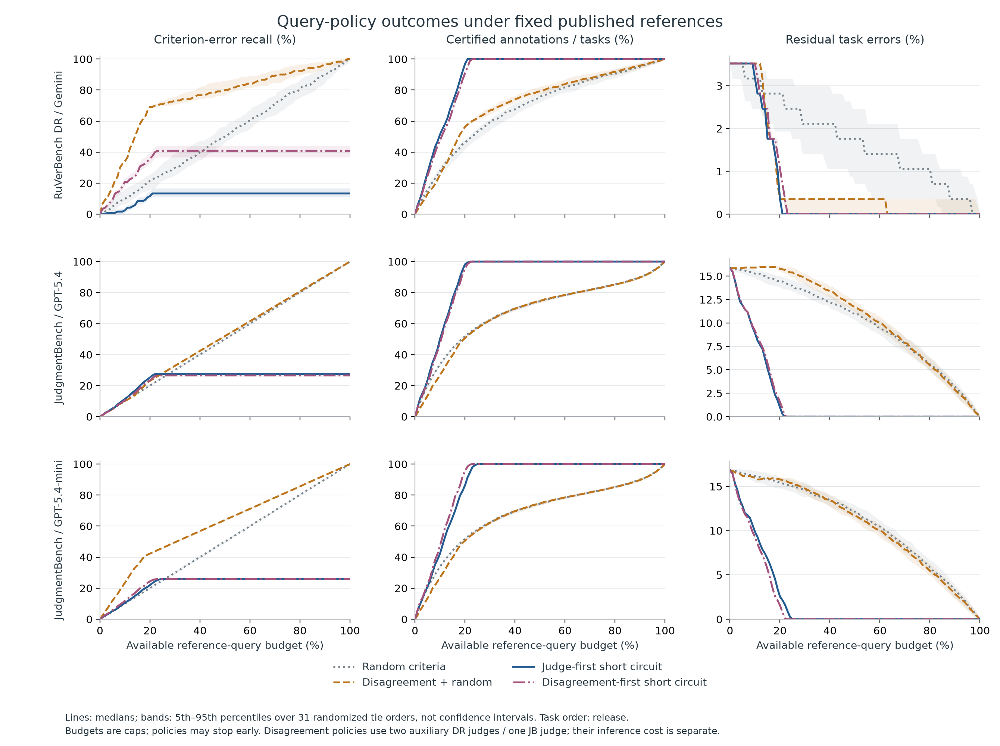
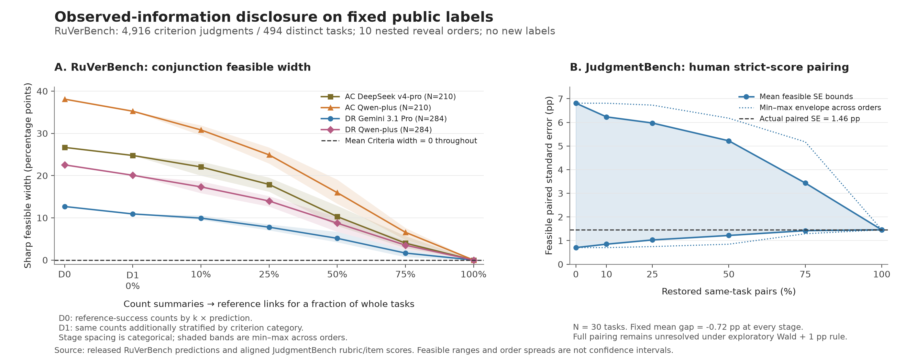

# Results and numerical anchors

The tables below refer to fixed released references and saved predictions. The package retains the complete result grids and the contrary cases. Query counts are existing reference bits inspected during replay; they are not newly collected annotations or human minutes.

## Analysis frames

`N` counts tasks in RuVerBench and output-by-rater annotations in JudgmentBench. FP means a predicted task PASS against reference FAIL; FF means predicted FAIL against reference PASS.

| Exact cell key | N | Base tasks | Criterion records | Reference PASS | Criterion errors | Initial task FP / FF |
|---|---:|---:|---:|---:|---:|---:|
| DR Gemini 3.1 Pro | 284 | 284 | 1,615 | 28 | 120 | 8 / 2 |
| DR Qwen-plus | 284 | 284 | 1,615 | 28 | 285 | 28 / 3 |
| AC Qwen-plus | 210 | 210 | 843 | 117 | 102 | 31 / 10 |
| AC DeepSeek v4-pro | 210 | 210 | 843 | 117 | 65 | 14 / 16 |
| DR GPT-5.4 low | 284 | 284 | 1,615 | 28 | 124 | 8 / 2 |
| JB GPT-5.4 | 1,539 | 30 | 23,487 | 227 | 5,655 | 24 / 220 |
| JB GPT-5.4-mini | 1,539 | 30 | 23,487 | 227 | 7,537 | 36 / 223 |
| JB GPT-5.4 \| binary_only | 1,539 | 30 | 20,229 | 266 | 3,807 | 181 / 67 |
| JB GPT-5.4-mini \| binary_only | 1,539 | 30 | 20,229 | 266 | 5,423 | 457 / 36 |

Source: [`study.json`](../artifacts/expected/conjunction_policy_study/study.json), `datasets[cell]`. The nine cells reuse two data families; binary-only JudgmentBench changes the scoring target. Full JudgmentBench has 1,314 distinct outputs and 49 raters. RuVerBench's placeholder reference-rater identifier is not evidence that only one human produced its references.

## RQ1: partial correction and verdict updating

The following rows use **canonical seed 0, release task order**. Each row compares eager and certificate-gated updating on the **same queried set**. Query costs differ between rows when a policy exhausts its candidates.

| Cell / query policy | Actual queries | Eager residual errors | Eager introduced FP | Gated residual errors | Delayed FF repairs |
|---|---:|---:|---:|---:|---:|
| DR Gemini / random criterion | 323 | 7 | 0 | 8 | 1 |
| DR Gemini / judge-first short circuit | 323 | 1 | 0 | 1 | 0 |
| JB GPT-5.4 / random criterion | 4,697 | 231 | 18 | 238 | 25 |
| JB GPT-5.4 / judge-first short circuit | 4,697 | 10 | 0 | 11 | 1 |
| JB GPT-5.4 / disagreement only | 4,316 | 245 | 5 | 242 | 2 |
| JB GPT-5.4 / disagreement then random | 4,697 | 239 | 6 | 242 | 9 |

Source: [`study.json`](../artifacts/expected/conjunction_policy_study/study.json), `canonical_20pct`, filtering the cell and policy with `task_order=release`; fields `residual_errors`, `introduced_fp`, `gated_residual_errors`, and `delayed_ff_corrections`.

The disagreement-only endpoint is a concrete nonmonotonicity example: **1,217 criterion errors repaired, yet 244 → 245 task errors**. It repairs two initial FP and two initial FF while introducing five FP. At the matched 4,697-query fallback point, gating prevents six introduced FP but delays nine useful FF repairs, leaving 242 errors instead of 239. These examples establish possibility and measured incidence in the studied frames, not typical harm from correction.

Scoring construction changes the regime. Full JB strong has 24 FP and 220 FF; binary-only has 181 FP and 67 FF. Of the 220 full-target FF, 156 involve only penalty rejection and 64 involve both item types. The full strong target has 178 susceptible annotations across 19 base tasks; strong DR has none. Those 178 annotations are potential or cumulative transition events, not 178 simultaneous or final errors. Source: [`error_flow.json`](../artifacts/expected/conjunction_policy_study/error_flow.json), `datasets[cell]`.

## RQ2: common-budget policies

These are **marginal medians over seeds 1–31**, release task order, at a 20% criterion cap. Both policies in each cell consume the same actual queries. Criterion-error discovery is compared only while holding the primary judge fixed.

| Cell / policy | Actual queries | Criterion errors found | Certified units | Residual task errors |
|---|---:|---:|---:|---:|
| DR Gemini / judge-first short circuit | 323 | 14 | 275 | 1 |
| DR Gemini / disagreement then random | 323 | 83 | 160 | 1 |
| JB GPT-5.4 / judge-first short circuit | 4,697 | 1,431 | 1,512 | 15 |
| JB GPT-5.4 / disagreement then random | 4,697 | 1,306 | 779 | 243 |
| JB mini / judge-first short circuit | 4,697 | 1,661 | 1,328 | 39 |
| JB mini / disagreement then random | 4,697 | 3,188 | 779 | 243 |
| AC DeepSeek / judge-first short circuit | 169 | 10 | 75 | 23 |
| AC DeepSeek / disagreement then random | 169 | 33 | 49 | 14 |

Source: [`budget_curves.csv.gz`](../artifacts/expected/conjunction_policy_study/budget_curves.csv.gz), filter `task_order=release`, `budget_share=0.2`, and seeds 1–31. Marginal medians need not coexist in a single run.

The criterion-discovery/certification reversal holds in **31/31** orders for DR Gemini and JB mini, but **0/31** for the stronger full-target JB judge. Its earlier canonical-order reversal is therefore order-sensitive. Use the exact `sc_judge_vs_disagreement_fallback_randomized_20pct` contrast in [`analysis_summary.json`](../artifacts/expected/conjunction_policy_study/analysis_summary.json); the all-grid 31/671 JB count has a different denominator.

The strongest available primary is an essential control. At release-order 20%, weak-primary-plus-strong-auxiliary disagreement short circuit has lower certification and higher task residuals than direct strong-primary short circuit in all 31 randomized orders. Under predicted-FAIL-count task order it instead trades less certification for fewer residual errors. Neither comparison supports universal dominance across objectives and orderings.

### Completed sensitivity analyses

The full study contains **6,048 trajectories, 610,848 budget rows, and 1,968,288 base-task deletion rows**. These are dependent replays of the same finite frames, not independent evidence counts. Seven policies, three task orders, and all 101 budget points are retained.

At 20%, coverage/residual-error tradeoffs between task orders occur in 31/31 randomized orders for DR Gemini and full JB strong, but only 11/31 for DR GPT-5.4 and 9/31 for AC Qwen. Corresponding canonical-order base-task-deletion counts are 283/284, 26/30, 2/284, and 0/210. Random-order robustness and deletion robustness answer different questions. All denominator definitions and other cells remain in `analysis_summary.json` and the saved deletion CSV.

Bands are ordering quantiles, not confidence intervals. Once certification is complete, further available budget does not imply additional queries.

## RQ2: estimation and a fixed allocation

The fixed `sc50_then_srs` allocation uses up to half the criterion cap for certification, followed by an independent SRS from the remaining records. This is a classical constructive control with an untuned split. It permits unbiased microaccuracy estimation under its sampling design, while leaving precision and task outcomes to be measured.

Release task order, 20% criterion cap, seeds 1–31:

| Cell / allocation | Actual queries | Certified | Residual errors | Accuracy RMSE (pp) | 95% interval width (pp) |
|---|---:|---:|---:|---:|---:|
| DR Gemini / random criterion SRS | 323 | 131 | 8 | 1.37 | 5.51 |
| DR Gemini / pure judge-first short circuit | 323 | 275 | 1 | — | — |
| DR Gemini / fixed 50/50 | 323 | 169 | 9 | 1.54 | 7.62 |
| AC DeepSeek / random criterion SRS | 169 | 31 | 24 | 2.35 | 7.95 |
| AC DeepSeek / pure judge-first short circuit | 169 | 75 | 23 | — | — |
| AC DeepSeek / fixed 50/50 | 169 | 51 | 24 | 2.18 | 10.79 |
| JB GPT-5.4 / random criterion SRS | 4,697 | 798 | 223 | 0.50 | 2.21 |
| JB GPT-5.4 / pure judge-first short circuit | 4,697 | 1,512 | 15 | — | — |
| JB GPT-5.4 / fixed 50/50 | 4,697 | 1,035 | 133 | 0.56 | 2.95 |

Certification, residual errors, and widths are marginal medians. RMSE is computed across the 31 estimates, not a median. Pure-SC ranges are logical and are deliberately omitted from the confidence-interval column. Source: [`budget_estimation_summary.csv`](../artifacts/expected/conjunction_label_value/budget_estimation_summary.csv), keyed by exact cell, order, policy, and share.

The mixed allocation improves both task metrics over SRS in all 31 paired JB orders. In DR it improves certification in all 31, but leaves more residual errors in 18. AC illustrates a further boundary: its displayed mixed-allocation median residual is unchanged, and its interval is wider. A better value on one metric does not establish a common preferred policy without specifying the intended conclusion.

### Whole-unit sampling uses a different resource design

At an approximately 20% **unit sample**, both full-rubric and short-circuit procedures certify the same sampled units and obtain the same task-pass estimate:

| Frame | Fixed sample size | Full-rubric query cost | Short-circuit query cost | Exact task-pass design RMSE (pp) |
|---|---:|---:|---:|---:|
| DR Gemini | 57 / 284 | 319 | 67 | 3.54 |
| AC DeepSeek | 42 / 210 | 177 | 102 | 6.87 |
| JB GPT-5.4 | 308 / 1,539 | 4,690 | 1,002 | 1.81 |

Query costs are 31-seed medians. Fixed sample counts and variable label costs make this a different comparison from the preceding fixed-cap table. Exact design RMSE uses finite-frame variance; the allocation table reports empirical 31-seed RMSE. Source: [`whole_task_sampling.csv.gz`](../artifacts/expected/conjunction_label_value/whole_task_sampling.csv.gz), `requested_task_share=0.2`.

## RQ3: information sufficiency

The query-only logical interval has width equal to the uncertified fraction. Statistical estimation can remain informative without certifying the full frame.

The separate reference-link disclosure replay supplies additional trusted reference-containing counts. In DR Gemini, D0 has 38 count cells and no new labels; the compatible reference pass rate is **[4.225352%, 16.901408%]**, width **12.676056 pp**, containing the fixed 9.859155% reference score. Restoring all links recovers the exact score. Across all four original RuVerBench runs, task-uniform Mean Criteria is already identified at D0. Source: [`information_disclosure_replay.json`](../artifacts/expected/information_disclosure_replay.json), `ruverbench[run].baseline` and `task_link_curve`.

Left: feasible conjunction widths under increasingly informative disclosures. Right: the separate, optional pairing diagnostic for human strict JudgmentBench scores. Shading and envelopes summarize reveal orders, not confidence coverage.

For that pairing diagnostic, the mean excellent-minus-good gap is always **−0.716 pp**. No pair links permit paired standard errors from **0.704 to 6.811 pp**; full pairing recovers **1.457 pp**. All six source-by-metric comparisons remain unresolved under the exploratory Wald-plus-1pp rule even with full pairing. The arms are constructed quality tiers and the mean gap was already identified, so this is not a system-ranking result.

## Boundaries that belong with the findings

References are treated as correct for the defined target; query costs omit human-time variation and model inference costs. Nine cells do not establish universal external validity. JudgmentBench's strict scoring construction, primary judge, within-unit order, task order, and update rule all affect the results. Conditional pointwise inference should not be relabeled as sequential or simultaneous coverage. The completed study supports explicit choices among evaluation targets and resource designs, rather than a new universally optimal audit method.
