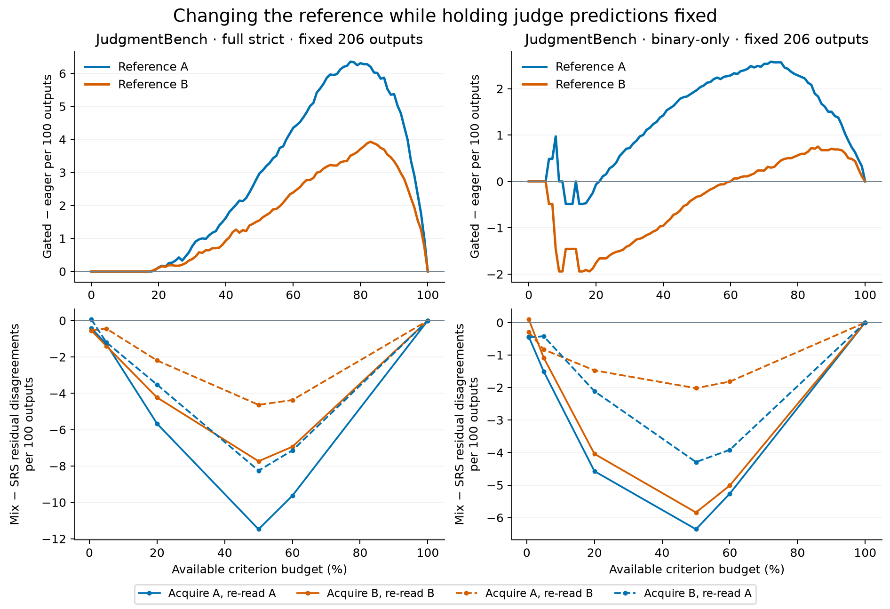
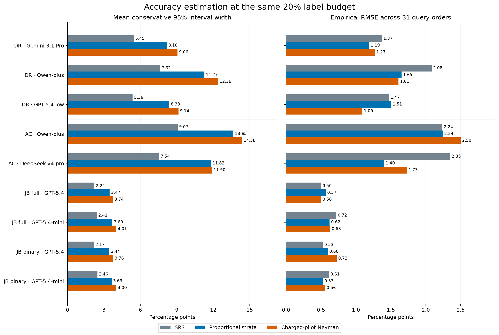

# Reference choice, task composition and estimation controls

The extension tests three limits of the original results. It holds judge predictions fixed while changing the human reference, reruns policies after resampling entire base tasks, and compares estimation against two budget-accounted stratified controls. The original large JudgmentBench update effect persists in direction on the matched reference subset but changes in size. Some other update comparisons reverse. At the focal 20% budget, the allocation benefit in JudgmentBench survives the examined reference and task-composition changes; the small RuVerBench error increase does not survive task-composition changes consistently.

In the original full-target frame, GPT-5.4 predicts PASS for 31 of 1,539 annotations (2.0%), compared with 227 reference PASS annotations (14.7%); seven are recognized by the judge. Its predictions are strongly FAIL-dominated, which shapes the repair and certification results. The target itself is not constant.

These are retrospective checks on the existing releases. The [protocol](../context/conjunction_robustness_protocol.md) fixes their finite grids and estimands. “Error” below means disagreement with the named released reference. Full strict and binary-only define different success events; both are constructed conjunction targets. The references have not been adjudicated by this study.

## Reference choice on the same outputs

JudgmentBench contains 206 outputs with repeated human annotations. The original 431 annotations of those outputs are weighted by annotation. Our matched analysis instead gives each output one unit, chooses two distinct raters by an ID-hash rule, and fixes both primary and auxiliary predictions from an independently hash-chosen saved judge assignment. A and B are symmetric panel labels, with no temporal or quality ordering; the selected raters can differ across outputs. There are 206 units under either reference, with 3,098 full-target or 2,664 binary-only criterion records. Changing reference therefore does not silently change the judge run, rubric, output sample or unit weights. The [pair map](../artifacts/expected/conjunction_robustness/reference/pairing.csv) records the selections.

The [frame diagnostics](../artifacts/expected/conjunction_robustness/reference/frame_diagnostics.json) bridge three frames: all 1,539 original annotations, their 431 repeated-output annotations, and the new 206 equally weighted outputs. In the original repeated-annotation subset, 32 of 54 initial false fails have at least one peer rater who also says FAIL; only 22 of 56 reference-PASS annotations have all peers agree PASS. These are disagreement diagnostics, not known reference-error rates or percentages of the whole-frame update effect.

For the fixed GPT-5.4 anchor in the 206-output full-target frame, reference A has 31 PASS outputs and reference B has 23; the judge has four under either reference. The two references disagree on 32 output verdicts. Their criterion agreement is 2,462/3,098 (79.47%). This selected pair statistic has a different weighting from the all-pairs or all-annotations diagnostics.

### Updating: size can change, and some directions reverse

For disagreement-then-random, the same nonadaptive query sets support both reference evaluations. Entries are means over 31 query orders, in **gated minus eager residual disagreements**:

| Fixed GPT-5.4 frame | Budget | Reference A | Reference B | A / B per 100 outputs |
|---|---:|---:|---:|---:|
| Full strict | 20% | +0.26 | +0.23 | +0.13 / +0.11 |
| Full strict | 84% | +12.42 | +8.00 | +6.03 / +3.88 |
| Binary-only | 20% | −0.13 | −3.61 | −0.06 / −1.75 |
| Binary-only | 84% | +4.29 | +1.48 | +2.08 / +0.72 |

Thus the large high-budget penalty is reference-sensitive even where its direction persists. The low-budget advantage in the original 1,539-unit full frame is absent under both references in this matched subset. That difference also involves changing the sample, weights and anchor draw; it is not a pure reference-replacement effect. On the *same* 206 outputs, binary-only random criterion sampling at 20% changes from +1.00 with A to −1.00 with B. For the mini judge under binary-only disagreement-then-random, the same endpoint changes from −1.48 to +0.94. The complete grid retains these contrary cases. At the smallest 0.6% allocation cap, some binary-only reference configurations lose certificates and increase disagreement; the 20% benefit is not a whole-grid dominance claim. [RQ1 table](../artifacts/expected/conjunction_robustness/reference/rq1_summary.csv)

### Allocation: distinguish re-reading from reacquiring

For adaptive acquisition, reference replacement can change which items get queried. We therefore cross the reference driving acquisition with the reference supplying both queried replacement labels and endpoint truth. An off-diagonal cell retains acquired positions but re-reads their labels. It is a counterfactual fixed-set evaluation, not an executable transcript in which one keeps A's answers while declaring B to be truth.

At 20% full-target budget, both policies spend 620 queries. Entries are paired **50/50 allocation minus SRS** means over 31 orders:

| Reference driving acquisition | Reference used to read and score | Extra certificates | Residual disagreement change |
|---|---|---:|---:|
| A | A | +27.65 | −11.68 |
| A | B | +14.90 | −4.52 |
| B | A | +13.58 | −7.26 |
| B | B | +32.13 | −8.71 |

All four mean contrasts increase certification and reduce disagreement. The cross-reference comparisons still contain individual contrary query orders: A/B increases disagreement in 2 of 31 orders, and B/A in 1 of 31. The two diagonal analyses retain a benefit, while holding A’s acquired set fixed exposes a larger reference-dependent change. These subset counts cannot be subtracted directly from the original −90.06 result. [RQ2 table](../artifacts/expected/conjunction_robustness/reference/rq2_summary.csv)

Top: disagreement-then-random update differences on the same 206 outputs. Bottom: allocation differences; dashed curves hold queried positions from one reference and re-read using the other. Lines summarize 31 orders, without population confidence bands. The full and binary-only percentage caps correspond to different absolute query counts.

## Base-task composition sensitivity

We resample complete base-task blocks 399 times, preserving all their outputs, raters and criteria. The two JudgmentBench targets share the same base-task multiplicities. Every replicate has its own unit/criterion totals, rounded query budgets and rerun policies. RQ1 averages query orders analytically; RQ2 averages the same 31-seed panel within each replicate. This is sensitivity to the empirical task composition. Population confidence claims would additionally require a defensible sampling model for the curated tasks.

Disagreement-then-random, 101 budget caps. Both rows use common vertical scales across frames. Shading is the pointwise 2.5th–97.5th percentile across compositions. Every curve is exactly zero at 0% and 100% budget. The original constant-width simultaneous bands remain in the source tables and plotting CSV but are omitted here: their constant radius obscures the known endpoints. Peaks are recomputed in every replicate. [All curves and summaries](../artifacts/expected/conjunction_robustness/cluster/summary.json)

For full JudgmentBench, the original order-expected gated-minus-eager difference at 20% is −0.13 per 100 annotations; its composition range is [−0.54, +0.39]. At 84%, it is +6.26, with range [+3.51, +9.44]. The high-budget burden and the small low-budget advantage thus have different stability for this query policy. This composition study retains the original reference and annotation weights; the separate 206-output A/B study does not provide a joint reference-by-composition interval. Original full and binary-only count curves retain their different scales, rather than being represented by a single favorable endpoint.

For the 20% mixed allocation:

| Frame | Original residual change per 100 units | 2.5th–97.5th composition range | Replicates with fewer disagreements |
|---|---:|---:|---:|
| JB GPT-5.4 full | −5.85 | [−7.99, −4.09] | 399 / 399 |
| JB GPT-5.4 binary-only | −3.81 | [−4.95, −2.05] | 399 / 399 |
| DR Gemini | +0.28 | [−0.91, +0.51] | 196 / 399 |

All three frames gain certificates in all 399 replicates. DR has 198 disagreement increases and five ties. Its original small increase is therefore an example of certification without dependable repair benefit, rather than a stable claim that the allocation makes DR worse. The table's original binary-only value must be read from the saved paired result, not from marginal medians. [Allocation resamples](../artifacts/expected/conjunction_robustness/cluster/rq2_frame_means.csv.gz)

## Budget-accounted stratified controls

The estimand is criterion-level microagreement with the fixed reference. SRS remains a transparent control. Proportional stratification uses the primary predicted PASS/FAIL label. A second design charges about 20% of its cap to a pilot, estimates within-stratum variability from those observed labels, then applies a capacity-constrained Neyman allocation to the remaining items. All pilot and subsequent labels count toward the same cap. Tiny caps use an explicitly recorded SRS fallback.

Conditional on the pilot, the estimator adds its known correct total to the estimated remaining totals. Each noncensused remaining stratum gets a hypergeometric count interval, with Bonferroni error allocation; their endpoints sum to a conservative conditional 95% interval. These are finite-population stratified controls, not a reimplementation of StratPPI. The latter is an essential related approach with different inferential machinery. [Fisch et al.](https://proceedings.neurips.cc/paper_files/paper/2024/hash/c9fcd02e6445c7dfbad6986abee53d0d-Abstract-Conference.html)

The figure shows all nine analysis cells at the 20% label cap. Interval width and point-estimator error answer different questions: the width reflects the chosen coverage guarantee and its conservatism; RMSE measures squared estimation error across the 31 saved query orders.

Left: mean conservative conditional 95% interval width. Right: empirical RMSE, computed as the square root of mean squared error against fixed-frame criterion microagreement. All values are percentage points; pilot labels count toward the budget. The RMSE repetitions describe these frames rather than establish population performance or interval coverage.

For proportional stratification versus SRS, empirical RMSE falls from **2.35 to 1.40 pp for AC DeepSeek v4-pro**, and from **1.37 to 1.19 pp for DR Gemini**. The corresponding interval widths increase from 7.54 to 11.82 pp and from 5.45 to 8.18 pp. Improvement is not shared by every judge: AC Qwen's RMSE is 2.24 under either design after rounding, while full-JB GPT-5.4 changes from 0.50 to 0.57 pp. The complete display retains the charged-pilot results and both JB scoring targets.

Neither stratified guarantee-based interval is narrower in the 45 noncensus cell×cap comparisons. This includes the conservatism of combining per-stratum bounds. Approximate normal intervals are separately recorded for all methods using the same finite-population variance construction. In full JB, proportional stratification narrows their mean width from 2.19 to 2.13 pp, but only 28/31 intervals cover the fixed truth in these repetitions. Width alone therefore cannot rank estimators, and these repetitions cannot establish a coverage guarantee. [Complete estimation results](../artifacts/expected/conjunction_robustness/estimation/stratified_summary.csv)

## Numerical repair and validation

The inclusive hypergeometric endpoint now returns [0,13] for M=16, n=2, x=0 at 95%. A threshold-near floating-point result triggers exact integer/rational tail comparison. Exact enumeration checks all observation acceptance sets and coverage for M≤24, with separate two-stage estimator and conditional-coverage tests. The regression compares 11,718 saved label-value intervals and 837 saved whole-unit intervals: **none of the 12,555 saved rows changes**. Original tables and their provenance remain historical artifacts. [Interval regression](../artifacts/expected/conjunction_robustness/estimation/interval_regression.json)

The reference implementation scores query masks directly and checks unchanged nonadaptive transcripts. The cluster implementation checks its vectorized short-circuit transcript against the original replay. Tests enumerate small worlds; a fresh public reproduction additionally compares all new scientific tables row by row. File hashes establish file integrity separately from those arithmetic checks. [Reproduction commands and receipts](REPRODUCIBILITY.md)

## What the evidence contributes

The measured question is how limited checks translate into estimates, certificates and changed verdicts. Delayed repairs depend on initial false fails, the locations of predicted failures and how likely the remaining checks are to finish. They do not equal a false-fail count multiplied by rubric length. Changing the reference or task composition can change that balance.

Sequential testing already supplies short-circuit logic and cost-sensitive check ordering. Human-uncertainty work already establishes that judge assessment depends on reference choice. The new evidence here measures the consequences jointly for fixed-label acquisition and conjunctive verdict updates, with counterexamples and sensitivity analyses on the released frames. [Ünlüyurt](https://doi.org/10.1016/j.dam.2002.08.001), [Elangovan et al.](https://proceedings.iclr.cc/paper_files/paper/2025/hash/8798321486948322be2b4d658744ba72-Abstract-Conference.html)

The earlier matched-margin rearrangements show that criterion confusion summaries can be compatible with different downstream checking outcomes. This is a concrete reporting-sufficiency example built on classical dependence facts. RuVerBench releases linked records, enabling our analysis; the issue is relying on its criterion summaries alone. The rearrangements also change task pass rates, so they do not isolate a causal correlation effect. [Mechanism tables](../artifacts/expected/conjunction_mechanism/update_permutation_summary.csv)
